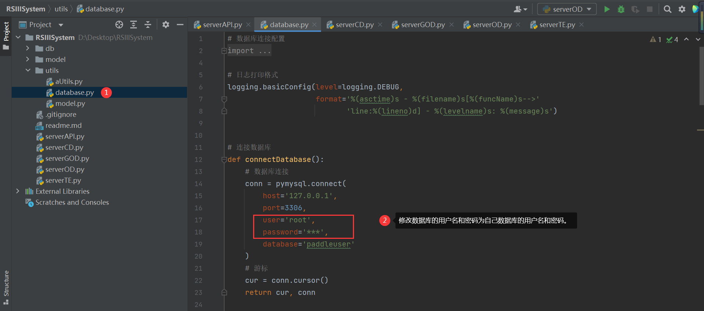

## 遥感图像智能解译系统-Web后端

### 01、环境搭建

Python 版本需为 3.7.5，否则可能会出现大量的报错。

安装好 Python 后，用 pip 依次执行下列语句，安装第三那方库：

~~~assembly
pip install matplotlib
pip install pymysql
pip install paddlepaddle
pip install paddlers
pip install flask
pip install Flask-Cors
pip install protobuf==3.20.0
pip install filelock
~~~

Mysql 数据库版本任意即可，需在数据库中创建`paddleuser`数据库，然后执行`db`文件夹中的`user.sql`文件，创建 user 表。

由于项目需要连接数据库，因此要修改`database.py`文件中的连接属性，如图：

至此，环境搭建完毕！

### 02、程序运行

推荐使用 Pycharm 软件运行本程序。

serverAPI.py：用于访问数据库，单独运行。

serverCD.py：用于变化检测，单独运行。

serverGOD.py：用于地物分类，单独运行。

serverOD.py：用于目标检测，单独运行。

serverTE.py：用于目标提取，单独运行。